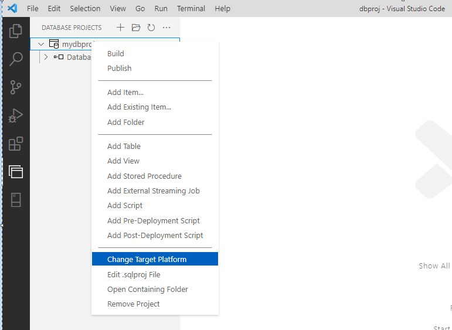

# sdksqlproj

Deploying Azure Synapse Dedicated SQL Pools from GitHub Actions using Linux hosted runners.

## **Prerequisites**
* Github Account
* Git
* VS Code (Extensions: SQL Server (mssql))
* Azure Account (with an existing Synapse Workspace with Dedicated SQL Pool or Dedicated SQL Pool (Formerly SQL DW))


## **Create a database project**
Using either Visual Studio, or Visual Studio Code, create a database project (in our case, we're going to create an Azure SQL Database Project):


We want to choose a SDK-style project. SDK-style projects can be built on Linux hosted runners. Default SQL Database Projects use .NET 4.8 which isn't supported on Linux.


Once the project is created, right click on the database project and change the target platform as required:



In our case, we're going to choose Azure Synapse Dedicated SQL Pool


## **Create an Azure Service Principal for GitHub**

[Create an Azure service principal with the Azure CLI](https://docs.microsoft.com/en-us/cli/azure/create-an-azure-service-principal-azure-cli)

An Azure service principal is an identity created for use with applications, hosted services, and automated tools to access Azure resources. This access is restricted by the roles assigned to the service principal, giving you control over which resources can be accessed and at which level. For security reasons, it's always recommended to use service principals with automated tools rather than allowing them to log in with a user identity.

In this case, our Github Action will use the Azure Service Principal to connect to our Azure tenet and deploy our database changes.

Example:
From the Azure CLI:
This will create a Service Principal with the Contributor RBAC role for the bicep-rg resource group:
```
az ad sp create-for-rbac --role contributor --sdk-auth --name "bicepsqldeployserviceprincipal" --scopes /subscriptions/<subscription id>/resourceGroups/bicep-rg
```

The output from this command will look something like:
```json
{
  "clientId": "<GUID>",
  "clientSecret": "<GUID>",
  "subscriptionId": "<GUID>",
  "tenantId": "<GUID>",
  "activeDirectoryEndpointUrl": "https://login.microsoftonline.com",
  "resourceManagerEndpointUrl": "https://management.azure.com/",
  "activeDirectoryGraphResourceId": "https://graph.windows.net/",
  "sqlManagementEndpointUrl": "https://management.core.windows.net:8443/",
  "galleryEndpointUrl": "https://gallery.azure.com/",
  "managementEndpointUrl": "https://management.core.windows.net/"
}
```
Put these values in a safe place, you will need them later. The only time you see these values are when you're createing the Service Principal.

Add the created credentials to Github Secrets:
In settings, go to Secrets, Actions, "New repository secret", give it a name, and copy the output from the Azure CLI in the Value and click on Add secret.


## **Github Action - Linux Runner**
To automatically deploy the project, use a GitHub action.


Within your GitHub repo, select Actions from the menu and select "New Workflow" and click on the "Configure" button in the "Simple Workflow" box


Name your work flow, and in the edit dialog, replace the sample text with the code below the image:


```yaml
#links:
#https://github.com/marketplace/actions/setup-msbuild
#https://github.com/Azure/run-sqlpackage-action
#https://github.com/marketplace/actions/run-sqlpackage?version=v1.0.0
#https://github.com/Azure/azure-resource-login-action
#https://docs.microsoft.com/en-us/answers/questions/729421/build-sqlproj-on-linux.html
#https://www.programmingwithwolfgang.com/deploy-dacpac-linux-azure-devops/

on: 
 #workflow_dispatch is run on command
 workflow_dispatch:
 #pull request will run on a completed pull request on the branch specifid
 pull_request:
    branches:
      - master

jobs:
  build:
    #use either windows runners (windows-latest) or Linux (ubuntu-latest)
    #https://docs.github.com/en/enterprise-cloud@latest/actions/using-github-hosted-runners/about-github-hosted-runners
    runs-on: ubuntu-latest
    
    steps:
    - uses: actions/checkout@v1

    - uses: azure/login@v1
      with:
        creds: ${{ secrets.AZURE_CREDENTIALS }}

    #example of reading params from a json file (example, a bicep json file)
    - id: getParams
      run: |
        content=`cat ./msft.synapse.main.params.json`
        # the following lines are only required for multi line json
        content="${content//'%'/'%25'}"
        content="${content//$'\n'/'%0A'}"
        content="${content//$'\r'/'%0D'}"
        # end of optional handling for multi line json
        echo "::set-output name=packageJson::$content"
    
    #testing output from the previous command
    #- name: echo synapseWorkspaceName
    #  run: echo "${{fromJson(steps.getParams.outputs.packageJson).parameters.synapseWorkspaceName.value}}.sql.azuresynapse.net"
    
    #- name: echo synapseDedicatedSQLPool
    #  run: echo "${{fromJson(steps.getParams.outputs.packageJson).parameters.synapseDedicatedSQLPool.value}}"

    #how to read secrets from an Azure keyvault (or possible to use the Service Principal if added to the database as a contained user)
    #https://docs.microsoft.com/en-us/azure/developer/github/github-key-vault
    - uses: azure/get-keyvault-secrets@v1
      with:
        keyvault: "bicep1-kv" # name of key vault in Azure portal
        secrets: "bicep-asw-admin-name,bicep-asw-admin-pwd"  # comma separated list of secret keys to fetch from key vault 
      id: getKeyVaultSecrets # ID for secrets that you will reference

    #build the project
    #linux
    - name: dotnet build
      run: dotnet build "./sdksqlproj/sdksqlproj.sqlproj" /p:NetCoreBuild=true
    
    #run the dacpac
    #linux
    - name: run sqlpackage
      run: sqlpackage 
        /Action:Publish
        /p:DropObjectsNotInSource=False
        #required for external tables, the dacpac will try and drop the external file format
        #which causes an error if it's in use. recommend a predeployment script to handle if required
        #(ie, drop\create the external table)
        /p:ExcludeObjectType=ExternalFileFormats
        /SourceFile:"./sdksqlproj/bin/Debug/sdksqlproj.dacpac"
        /TargetDatabaseName:${{fromJson(steps.getParams.outputs.packageJson).parameters.synapseDedicatedSQLPool.value}}
        /TargetPassword:${{steps.getKeyVaultSecrets.outputs.bicep-asw-admin-pwd}}
        /TargetServerName:"${{fromJson(steps.getParams.outputs.packageJson).parameters.synapseWorkspaceName.value}}.sql.azuresynapse.net,1433"
        /TargetUser:${{steps.getKeyVaultSecrets.outputs.bicep-asw-admin-name}}
```
